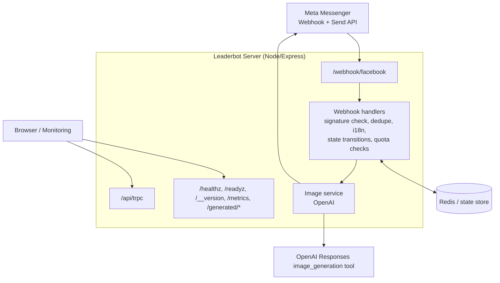

# Leaderbot AI Image Generator
[](https://github.com/Dj-Shortcut/openclaw-facebook/actions/workflows/fallow.yml)

A Meta messaging bot with a shared bot-core for Messenger and WhatsApp.

The active product scope is generic AI image generation and related bot infrastructure. Free text-to-image requests are the primary user experience; source-photo edits use natural-language prompts rather than legacy style-picker menus.

## Product Scope

Current repository focus:

- free text-to-image generation from natural Messenger prompts
- explicit source-photo edit/restyle flows when the user asks to edit a photo
- shared text handling across both Meta channels
- channel-specific media ingress and outbound message rendering
- operational tooling around state, quota, storage, security, and deployment

## Architecture

The runtime is a single Node/Express process that handles Meta webhook traffic, channel-specific outbound messaging API calls, shared bot/conversation logic, AI image generation orchestration, static asset serving, and operational endpoints.

ASCII version:

```text
                         +----------------------+
                         |   Meta Messenger     |
                         |  Webhook + Send API  |
                         +----------+-----------+
                                    |
                                    v
                    +----------------------------------+
                    |  Leaderbot Server (Node/Express) |
                    |----------------------------------|
                    | Routes:                          |
                    | - /webhook/facebook              |
                    | - /api/trpc                      |
                    | - /healthz, /readyz, /__version, /metrics|
                    | - /generated/*         |
                    +----+---------------+-------------+
                         |               |
          inbound events |               | outbound API / auth / storage
                         v               v
        +--------------------------+   +----------------------+
        | Webhook Handlers         |   | Supporting Services  |
        | - signature verification |   | - static file serve  |
        | - dedupe + i18n          |   | - health/debug       |
        | - state transitions      |   +----------------------+
        | - quota checks           |
        +------------+-------------+
                     |
                     v
        +--------------------------+
        | Image Service            |
        | - OpenAI image generator |
        +------------+-------------+
                     |
          +----------+----------+
          |                     |
          v                     v
        +-------------------+   +----------------------+
        | Redis / State     |   | Responses Image Tool |
        | - state store     |   | - generation backend |
        | - rate limit base |   +----------------------+
        +-------------------+
```

Mermaid version:



Key server entrypoint: `server/_core/index.ts`.
Webhook route registration: `server/_core/messengerWebhook.ts`.
Messenger webhook orchestration: `server/_core/webhookHandlers.ts`.
Normalized inbound message contract: `server/_core/normalizedInboundMessage.ts`.
Shared text/domain handler: `server/_core/sharedTextHandler.ts`.
Outbound response intent types and adapter mapping: `server/_core/botResponse.ts` and `server/_core/botResponseAdapters.ts`.
Bot core boundary and feature entrypoint: `server/_core/bot/index.ts` and `server/_core/bot/features.ts`.

For a deeper explanation, see [`docs/architecture.md`](docs/architecture.md).
Operational and audit notes live under [`docs/`](docs/).
Optional face-memory retention is documented in [`docs/face-memory.md`](docs/face-memory.md).

## State model

Conversation state is modeled per Messenger user (`psid`) with a normalized shape in `MessengerUserState`.

Primary stages:

- `IDLE`
- `AWAITING_PHOTO`
- `AWAITING_EDIT_PROMPT`
- `PROCESSING`
- `RESULT_READY`
- `FAILURE`

State persistence model:

- Default: in-memory `Map` state store (fast local/dev fallback).
- Optional: Redis-backed state store when `REDIS_URL` is configured.
- A pseudonymous `userKey` is derived from `psid` (`HMAC-SHA256`) for privacy-safe correlation.

Relevant files:

- `server/_core/bot/features.ts` (future bot feature hooks)
- `server/_core/messengerState.ts`
- `server/_core/stateStore.ts`
- `server/_core/privacy.ts`
- `drizzle/schema.ts` (DB table definitions, including `messengerState`)

## Bot-core extension model

The repository is now organized around an explicit bot-core boundary:

- `server/_core/bot/index.ts` exposes the Messenger bot runtime entrypoints used by server bootstrap.
- `server/_core/bot/features.ts` is the dedicated extension point for future bot features.

The built-in registry now starts with foundational bot middleware-style features such as rate limiting, prompt-first image/edit commands, conversational editing, and admin stats. Future bot features should prefer registering text/payload/image handlers there via `registerBotFeature(...)` instead of expanding unrelated web or admin codepaths.

Repository changes should prioritize generic prompt-first image generation and the supporting multi-channel bot/runtime foundation. Do not treat older style-catalog or experiment scaffolding as the roadmap by default.

## Multi-channel text flow

Text handling is now split into three layers:

- Channel adapters at the edge parse Messenger and WhatsApp webhook payloads into a normalized inbound shape.
- Shared domain logic in `server/_core/sharedTextHandler.ts` operates on that normalized shape and returns channel-agnostic bot intents.
- Channel adapters map outbound `BotResponse` intents into Messenger or WhatsApp send calls.

Current shared scope is intentionally limited to text messages. Image generation now accepts prompt-first requests, while media/source-image handling is still channel-specific and should only move once the shared contracts are ready.

Further boundary work should continue to reduce coupling between channel adapters and shared bot logic without expanding obsolete experiment paths.

## WhatsApp image flow

WhatsApp supports the prompt-first image journey and source-photo edits:

- inbound image webhooks are accepted on the shared Meta callback route
- WhatsApp media is downloaded through the Cloud API using the inbound media id
- the source image is persisted to a reusable public URL for follow-up edits
- users can describe the next image or edit in natural language
- generated images are returned through the WhatsApp Cloud API image send endpoint

Because the persisted source image is fetched again during generation, `SOURCE_IMAGE_ALLOWED_HOSTS` must include the hostname used for those stored source images. In local/dev setups this is usually the `APP_BASE_URL` host. In production it should include the public asset host returned by the storage layer.

## Messenger face memory

Messenger face memory is an optional source-photo reuse feature. It is disabled by default with `ENABLE_FACE_MEMORY=false` and must remain disabled until the consent copy, privacy policy, and deletion language are approved. Retention defaults to 30 days and can be shortened with `FACE_MEMORY_RETENTION_DAYS`; uploaded source and face-memory images have a hard 30-day object-storage maximum.

When enabled, the first photo upload asks the user whether Leaderbot may keep the uploaded photo for the configured retention window. A positive answer stores consent metadata and the retained source-image URL. A negative answer keeps the normal one-photo flow without reusable face memory. Users can delete retained face-memory data by sending `verwijder mijn data` or `delete my data`. Stored source-image URLs are refreshed through the storage proxy before generation when the proxy is configured.

For the full legal/ops checklist, rollout guidance, and kill-switch procedure, see [`docs/face-memory.md`](docs/face-memory.md).

## Quota model

There are two quota layers in the codebase, each with a 2-image/day free limit:

1. **Messenger flow quota in state** (`server/_core/messengerQuota.ts`)
   - Stored with `quota.dayKey` + `quota.count` in the user conversation state.
   - Resets by UTC day key.

2. **Database-backed quota** (`dailyQuota` table, used by DB helpers)
   - Tracks per-user daily usage (`YYYY-MM-DD`, UTC).
   - Includes atomic reserve/release helpers for safer concurrent updates.

Related files:

- `server/_core/messengerQuota.ts`
- `server/db.ts`
- `drizzle/schema.ts`
- `drizzle/0001_big_the_phantom.sql`
- `drizzle/0002_fix_daily_quota_unique.sql`

## Env vars

### Required

Operational env shortlist: [`docs/operations/ENV_SHORTLIST.md`](docs/operations/ENV_SHORTLIST.md)

- `JWT_SECRET` (required at startup; must be at least 32 chars)
- `PRIVACY_PEPPER` (required at startup, used for user-key hashing)
- `FB_VERIFY_TOKEN` (Webhook verification)
- `META_VERIFY_TOKEN` (preferred generic Meta webhook verification token; falls back to `FB_VERIFY_TOKEN` when unset)
- `FB_PAGE_ACCESS_TOKEN` (Messenger send API)
- `FB_APP_SECRET` (Webhook signature validation)
- `WHATSAPP_ACCESS_TOKEN` (WhatsApp Cloud API send API)
- `WHATSAPP_PHONE_NUMBER_ID` (WhatsApp Cloud API sender identity)
- `SOURCE_IMAGE_ALLOWED_HOSTS` (required for inbound source-image fetching; if unset, source-image fetches are blocked; review regularly and keep only trusted domains)
- `REDIS_URL` (required in production for webhook replay protection)
- `APP_BASE_URL` (required for public generated image URLs; must be `https://` in production)
- `OPENAI_API_KEY` (required for image generation)

### Common optional

- `WEBHOOK_REPLAY_TTL_SECONDS` (override webhook replay-protection TTL, default `300`)
- `HTTP_RATE_LIMIT_WINDOW_MS` (global HTTP rate-limit window, default `60000`; Redis-backed when `REDIS_URL` is set)
- `HTTP_RATE_LIMIT_MAX_REQUESTS` (max requests per IP per window, default `120`)
- `OPENAI_IMAGE_TIMEOUT_MS`, `FB_IMAGE_FETCH_TIMEOUT_MS` (per-request timeouts; OpenAI defaults to `180000ms` and applies per retry attempt)
- `OPENAI_IMAGE_MAX_OUTPUT_BYTES` (max decoded bytes accepted from the image provider before buffering the generated image, default `26214400`)
- `OPENAI_IMAGE_MAX_RETRIES`, `OPENAI_IMAGE_RETRY_BASE_MS` (retry policy for OpenAI image generation on `408`/`429`/`5xx`/transient network errors)
- `OPENAI_IMAGE_SIZE`, `OPENAI_IMAGE_QUALITY`, `OPENAI_IMAGE_OUTPUT_FORMAT`, `OPENAI_IMAGE_OUTPUT_COMPRESSION`, `OPENAI_IMAGE_BACKGROUND`, `OPENAI_IMAGE_ACTION`, `OPENAI_IMAGE_INPUT_FIDELITY` (optional Responses image-generation tool knobs; use `jpeg`/`webp` plus `medium` or `low` quality for faster Messenger tests, and keep `png`/higher quality for final quality-sensitive runs)
- `IMAGE_PROVIDER` (image provider boundary; currently only `openai-images`, which uses the existing OpenAI Responses image_generation tool flow)
- `OPENAI_EDIT_INTERPRETER_MODEL`, `OPENAI_EDIT_INTERPRETER_TIMEOUT_MS`, `OPENAI_EDIT_INTERPRETER_MAX_RETRIES` (optional classifier for conversational edit commands after a generated result)
- `DEFAULT_MESSENGER_LANG` (`nl`/`en` fallback behavior)
- `PRIVACY_POLICY_URL` (link sent in privacy quick reply)
- `MESSENGER_MAX_IMAGE_JOBS` (global cap for concurrent image generations, default `3`; Redis-backed across instances when `REDIS_URL` is set)
- `MESSENGER_GLOBAL_IMAGE_LOCK_TTL_MS` (Redis-backed global generation slot TTL, default `120000`)
- `MESSENGER_PSID_COOLDOWN_MS` (optional per-PSID cooldown between generations, default `0`)
- `MESSENGER_PSID_LOCK_TTL_MS` (per-PSID in-flight lock TTL, default `120000`)
- `GRAPH_API_MAX_RETRIES`, `GRAPH_API_RETRY_BASE_MS` (retry policy for Meta Graph API `429`/`5xx` responses)
- `ADMIN_TOKEN` (protects `/debug/build`)
- `NODE_ENV` (set to `production` to enforce production-only checks such as required `REDIS_URL`)
- `OAUTH_SERVER_URL` (enables OAuth route initialization)
- `LOG_LEVEL`, `DEBUG_STATE_DUMP`, `DEBUG_IMAGE_PROOF` (diagnostics)
- `MESSENGER_QUOTA_BYPASS_IDS` (comma-separated PSIDs or hashed user keys that skip Messenger daily quota; intended for internal testing/admin)
- `ENABLE_FACE_MEMORY` (`false` by default; enables explicit-consent Messenger source-photo reuse after legal approval)
- `FACE_MEMORY_RETENTION_DAYS` (optional positive whole number; defaults to `30`, is capped at `30`, and controls retained source-photo expiry plus Redis state TTL buffer)
- `PORT` (default `8080`)
- `BUILT_IN_FORGE_API_URL`, `BUILT_IN_FORGE_API_KEY` (used by the storage proxy contract; in production image generation these should point to the R2-backed proxy so generated Messenger attachment URLs are durable across Fly machines)
- `VITE_APP_ID`, `DATABASE_URL`, `OWNER_OPEN_ID`, `BUILT_IN_FORGE_API_URL`, `BUILT_IN_FORGE_API_KEY` (app/data integrations exposed via `server/_core/env.ts`)

Legacy/app-specific environment variables also exist for SDK and data API integrations in `server/_core/env.ts`.

### Free-text behavior

Free-text Messenger and WhatsApp messages use deterministic flow responses for non-image chat. Messenger image-generation prompts are routed to the image-generation service as text-to-image unless they explicitly ask to edit/restyle a source photo. The only current OpenAI image provider is `openai-images`, which uses the Responses API image_generation tool flow.

### Secret hygiene

- Never commit real `.env` files; only keep `.env.example` in git.
- If a secret appears in GitHub code search (for example by searching for `.env` in this repo), rotate all exposed credentials immediately.

## API documentation

The API is served through `tRPC` at `/api/trpc`, with types inferred directly from server routers.

For a human-readable reference of current procedures, auth requirements, and input/output shapes, see [`docs/trpc-api.md`](docs/trpc-api.md).

## Local dev

```bash
pnpm install
pnpm dev
```

Server defaults to `http://localhost:8080`.

Useful checks while developing:

```bash
curl http://localhost:8080/healthz
curl http://localhost:8080/readyz
curl http://localhost:8080/__version
curl http://localhost:8080/metrics
```

Production build locally:

```bash
pnpm build
pnpm start
```

## Testing

Core test/lint/typecheck commands:

```bash
pnpm test
pnpm check
pnpm lint
pnpm lint:server
```

Database migration helpers:

```bash
pnpm db:push
```

The repository includes focused unit tests for webhook handling, state transitions, signature verification, and image generation behavior under OpenAI configuration.

Multi-channel text routing now also has a small adapter-level test in `server/botResponseAdapters.test.ts` to verify `BotResponse` mapping independently from webhook payload parsing.

## Documentation standards

- Prefer JSDoc/TSDoc comments for exported functions, classes, interfaces, and non-trivial internal helpers.
- Write comments so they are parsable by tooling (for example, typed params/returns and clear behavior notes), making API-document generation easier.
- Keep documentation comments synchronized with implementation changes; when behavior, inputs, or outputs change, update the docblock in the same PR.
- Remove stale comments rather than leaving outdated guidance in place.

## Image prompts

New product behavior should prefer generic prompt-first image generation and natural-language source-photo edits. Do not rebuild legacy style-picker catalogs or preview menus.

For Facebook/Messenger share assets, use [`docs/invite-image-export-checklist.md`](docs/invite-image-export-checklist.md) as the required export, naming, and cache-busting workflow.

## Security: webhook signature verification

Incoming `POST /webhook/facebook` requests are authenticated using Meta's `X-Hub-Signature-256` header.

- Signature format must be `sha256=<hex-digest>`.
- The server captures the **raw request body** (`express.json({ verify })`) and computes `HMAC-SHA256(rawBody, FB_APP_SECRET)`.
- Signatures are compared with `timingSafeEqual` to avoid timing side channels.
- Missing/invalid signatures return `403`.

The signature middleware is only applied on the Messenger webhook POST route.

## Security: request body limits

The server uses a `10mb` limit for both `express.json` and `express.urlencoded` parsers.
Oversized payloads return `413` with a friendly JSON response:

```json
{
  "error": "Payload too large",
  "message": "Request body exceeds the 10mb limit."
}
```

## Deployment notes

This app is configured for Fly.io using `Dockerfile` + `fly.toml`.

### Durable image storage

Production Messenger image delivery and inbound source-image persistence use the R2-backed storage proxy described in [`docs/storage-proxy-r2.md`](docs/storage-proxy-r2.md). Without this proxy config, production image storage fails fast instead of creating gateway-local `/generated/*` URLs that would break across restarts or multiple Fly machines.

Main app settings:

- `BUILT_IN_FORGE_API_URL=https://leaderbot-storage-proxy.fly.dev`
- `BUILT_IN_FORGE_API_KEY=<same bearer token configured as FORGE_API_KEY on the proxy>`

Proxy app notes:

- The deployed Fly app is `leaderbot-storage-proxy`
- The separate empty Fly app `storage-proxy` is not used
- Preferred proxy commands are:

```bash
fly status -a leaderbot-storage-proxy
fly logs -a leaderbot-storage-proxy --no-tail
fly deploy --depot=false -a leaderbot-storage-proxy
fly secrets list -a leaderbot-storage-proxy
```

Typical deployment flow:

```bash
fly secrets set REDIS_URL=redis://<user>:<password>@<host>:<port> -a <app-name>
fly secrets set KEY=value -a <app-name>
fly deploy -a <app-name>
fly logs -a <app-name>
```

Operational notes:

- `NODE_ENV=production` and `PORT=8080` are expected in runtime.
- `REDIS_URL` must be set in Fly secrets before deploy; production startup now fails without it.
- `WHATSAPP_ACCESS_TOKEN` and `WHATSAPP_PHONE_NUMBER_ID` must be set in Fly secrets before deploy; startup now fails when either is missing.
- Liveness endpoint is `/healthz`; dependency readiness is exposed at `/readyz`.
- `/metrics` exposes Prometheus-style request counters and latency histograms.
- `/admin/disable-face-memory` is protected by `ADMIN_TOKEN` and clears retained face-memory state for emergency rollback.
- Each request carries an `X-Request-Id` header for simple request tracing across logs and downstream calls.
- The server accepts and returns `traceparent` so it can plug into OpenTelemetry-compatible tracing later without changing route behavior.
- `APP_BASE_URL` must be publicly reachable for local/dev image fallback. Production image delivery and persisted inbound source images require the storage proxy instead of gateway-local `/generated/<id>.png` URLs.
- Keep `FB_APP_SECRET` configured to enforce webhook signature verification middleware.
- Outbound WhatsApp sends use `server/_core/whatsappApi.ts` and the WhatsApp Cloud API `phone_number_id` configured through env, not hardcoded values.
- Set `SOURCE_IMAGE_ALLOWED_HOSTS` in production. Source-image fetches fail closed when it is unset. Use exact hostnames only, such as `scontent.xx.fbcdn.net,lookaside.fbsbx.com`; suffix allowlists like `fbsbx.com` are intentionally not expanded.
- For WhatsApp source-image reuse, also include the host that serves persisted inbound source images, such as your app host in local/dev or your storage public domain in production.
- Redis-backed webhook ingress preserves fast Meta ACKs while draining deliveries sequentially in-process, so a burst does not fan out every queued webhook handler at once.

### Messenger image worker rollout

`fly.toml` defines two process groups:

- `app`: the HTTP gateway that receives Meta webhooks.
- `worker`: the Messenger image generation worker. It starts with `MESSENGER_GENERATION_QUEUE_ENABLED=1` and `MESSENGER_GENERATION_WORKER_ONLY=1`, so it drains Redis jobs and does not bind the HTTP server.

Recommended migration sequence:

1. Deploy the code with the default gateway behavior. The gateway still runs generation inline unless `MESSENGER_GENERATION_QUEUE_ENABLED=1` is set for the app process.
2. Start at least one worker machine/process group.
3. Enable `MESSENGER_GENERATION_QUEUE_ENABLED=1` for the gateway while leaving `MESSENGER_GENERATION_INLINE_FALLBACK` unset. This keeps same-process draining available during rollout.
4. After worker logs show jobs are draining, set `MESSENGER_GENERATION_INLINE_FALLBACK=0` for gateway instances so image generation no longer runs in the HTTP process.
5. Watch the compact `messenger_generation_diagnostic`, `webhook_ack_sent`, and event-loop diagnostic logs before scaling gateway machines above one instance.

Worker-related env:

- `MESSENGER_GENERATION_QUEUE_ENABLED=1`: enqueue Messenger image generation jobs in Redis.
- `MESSENGER_GENERATION_INLINE_FALLBACK=0`: gateway does not drain queued jobs itself.
- `MESSENGER_GENERATION_WORKER_ONLY=1`: run only the worker loop, no HTTP listener.
- `MESSENGER_GENERATION_JOB_LEASE_SECONDS=900`: reserved-job lease before reclaim.
- `MESSENGER_GENERATION_MAX_ATTEMPTS=3`: failed generation jobs are retried up to this many processor attempts, then moved to the Redis dead-letter list.
- `MESSENGER_GENERATION_DRAIN_BATCH_SIZE=10`: max jobs a worker or inline fallback drain processes per drain pass before yielding to the next poll/enqueue.
- `MESSENGER_GENERATION_WORKER_POLL_MS=1000`: worker poll interval.
- `WEBHOOK_INGRESS_ENQUEUE_TIMEOUT_MS=450`: max time the gateway waits for Redis ingress enqueue before returning 503 so Meta can retry instead of losing the delivery.

When a worker exits while a generation is reserved, the next worker poll reclaims the expired lease, increments the job attempt count, and either requeues it or moves it to the dead-letter list once `MESSENGER_GENERATION_MAX_ATTEMPTS` is reached.

Production verification checklist:

- Confirm `/readyz` returns `ok: true` on gateway instances after deploy; failures report dependency names and redacted error classes only.
- Confirm `GENERATOR_STARTUP_CONFIG.messengerGenerationGlobalLimit.redisBacked=true` and `GENERATOR_STARTUP_CONFIG.messengerGenerationRuntime` has the expected gateway/worker/inline-fallback values before horizontal scaling.
- Confirm `/metrics` shows `messenger_generation_queue_enabled 1`, `messenger_generation_inline_fallback_enabled 0` on gateway instances after worker rollout, stable `messenger_generation_queue_jobs{state="queued"}`, and `messenger_generation_global_slots{state="active"}` below `state="max"` during normal load.
- Confirm `webhook_ack_sent` p95/p99 stays under 500ms after enabling Redis ingress queue and before increasing gateway instance count.
- Confirm event-loop diagnostics stay below `eventLoopDelayP99Ms=500` during normal Messenger image generation load.
- Confirm generated image URLs and persisted inbound source-image URLs come from the storage proxy host, not gateway-local `/generated/*` URLs.
- Confirm `messenger_generation_queue_jobs{state="failed"}` remains at 0 during rollout, or investigate matching `messenger_generation_job_dead_lettered` logs before continuing.
- After a worker restart test, confirm stale `processing` jobs are reclaimed and completed rather than remaining in `messenger-generation-jobs:processing`.
