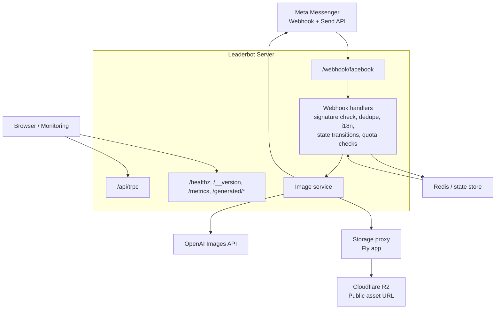

# Architecture and Runtime Model

## 1) Runtime topology

Leaderbot runs as one Node.js process (Express + HTTP server):

- Accepts Messenger webhook traffic.
- Accepts WhatsApp webhook traffic on the same Meta callback route.
- Supports outbound WhatsApp Cloud API sends.
- Shares normalized text/domain handling across Messenger and WhatsApp.
- Executes conversation flow + generation orchestration.
- Serves static assets (`/generated`, web build output).
- Exposes health/version/debug endpoints.
- Exposes an admin face-memory kill switch when `ADMIN_TOKEN` is configured.
- Exposes Prometheus-style metrics and request tracing hooks.
- Optionally mounts OAuth and additional chat routes.

Primary bootstrap is in `server/_core/index.ts`.

The bot runtime now has an explicit boundary in `server/_core/bot/index.ts`, with future feature hooks centralized in `server/_core/bot/features.ts`.

The repository still contains some experimental experience-routing modules behind a shared router + registry boundary, but that path is not the active product direction for Leaderbot.

## Architecture diagrams

ASCII version:

```text
                         +----------------------+
                         |   Meta Messenger     |
                         |  Webhook + Send API  |
                         +----------+-----------+
                                    |
                                    v
                    +----------------------------------+
                    |  Leaderbot Server (Node/Express) |
                    |----------------------------------|
                    | Routes:                          |
                    | - /webhook/facebook              |
                    | - /api/trpc                      |
                    | - /healthz, /__version          |
                    | - /metrics, /generated/*        |
                    | - /admin/disable-face-memory    |
                    +----+---------------+-------------+
                         |               |
          inbound events |               | outbound API / auth / storage
                         v               v
        +--------------------------+   +----------------------+
        | Webhook Handlers         |   | Supporting Services  |
        | - signature verification |   | - static file serve  |
        | - dedupe + i18n          |   | - health/debug       |
        | - state transitions      |   +----------------------+
        | - quota checks           |
        +------------+-------------+
                     |
                     v
        +--------------------------+
        | Image Service            |
        | - OpenAI image generator |
        +------------+-------------+
                     |
          +----------+----------+-------------------------+
          |                     |                         |
          v                     v                         v
        +-------------------+   +----------------------+  +---------------------------+
        | Redis / State     |   | OpenAI Images API    |  | Storage Proxy (Fly app)   |
        | - state store     |   | - generation backend |  | - Forge-style upload API  |
        | - rate limit base |   +----------------------+  | - returns durable URLs     |
        +-------------------+                             +-------------+-------------+
                                                                      |
                                                                      v
                                                        +-----------------------------+
                                                        | Cloudflare R2 + Public URL  |
                                                        | - object storage            |
                                                        | - public asset delivery     |
                                                        +-----------------------------+
```

Mermaid version:



## 2) Request flow (Meta messaging)

1. Meta sends webhook event to `POST /webhook/facebook`.
2. Signature middleware validates payload when `FB_APP_SECRET` is present.
3. Channel adapter parses provider payloads:
   - Messenger payloads fan in to `processFacebookWebhookPayload`
   - WhatsApp payloads are normalized from `entry[].changes[].value.messages[]`
4. Text messages are converted into a shared normalized inbound message shape.
5. WhatsApp image messages are downloaded via the WhatsApp Cloud API media endpoint and persisted to a reusable source-image URL.
6. Shared text/domain logic runs in `server/_core/sharedTextHandler.ts`.
7. Shared logic returns channel-agnostic outbound intents (`BotResponse`).
8. Channel adapters translate those intents into Messenger or WhatsApp sends.
9. Image/style flow state is still updated directly in channel orchestration (`setFlowState`, `setPendingImage`, `setChosenStyle`, ...), with WhatsApp using plain-text prompts where Messenger uses richer UI affordances.
10. If Messenger face memory is enabled, the first source-photo upload asks for explicit 30-day reuse consent before showing style options.
11. If generation is triggered:
   - state -> `PROCESSING`,
   - OpenAI image generator configuration,
   - result sent via Messenger Send API or WhatsApp Cloud API,
   - state -> `RESULT_READY` (or `FAILURE` on error).

Face memory is Messenger-only and disabled by default. See [`face-memory.md`](face-memory.md) for the legal/ops checklist.

### Source image provenance and trust

Source-image handling now distinguishes between externally supplied image URLs and internally persisted source images.

- `lastPhotoSource` in conversation state records whether the active source image is `external` or `stored`
- WhatsApp media that is downloaded and re-persisted through `storeInboundSourceImage(...)` is marked as `stored`
- Messenger attachment URLs and other direct inbound URLs remain `external`

Security motivation:

- prevent external image injection from bypassing `SOURCE_IMAGE_ALLOWED_HOSTS`
- ensure only app-owned persisted source images can use the trusted-source fast path

Enforcement model:

- image generation validates source URLs before fetching them
- the allowlist bypass is only allowed when the source is both marked trusted and proven to come from stored inbound media
- rejected trusted-source URLs are cleared from conversation state before the flow returns to `AWAITING_PHOTO`, so users do not get stuck retrying the same invalid URL

This provenance model is part of the image-generation security boundary and is especially important for the WhatsApp flow, where inbound media is first downloaded, then persisted to an application-owned public URL for later reuse.

Core files:

- `server/_core/messengerWebhook.ts`
- `server/_core/webhookHandlers.ts`
- `server/_core/normalizedInboundMessage.ts`
- `server/_core/sharedTextHandler.ts`
- `server/_core/botResponse.ts`
- `server/_core/botResponseAdapters.ts`
- `server/_core/imageService.ts`
- `server/_core/messengerApi.ts`

## 3) State model details

`MessengerUserState` is canonical runtime state. It stores:

- stage/status (`IDLE` .. `FAILURE`)
- latest photo URL fields
- latest photo provenance (`external` vs `stored`)
- selected style and optional preselected referral style
- preferred language
- pending/generated image references
- optional face-memory consent and retained source-image URL fields
- quota counters (`dayKey`, `count`)
- update timestamp

Persistence abstraction (`stateStore`) supports:

- **In-memory map** (default, easy local dev).
- **Redis** (if `REDIS_URL` configured), with TTL semantics.

Design intent:

- Keep state minimal and directly tied to Messenger flow.
- Normalize legacy/alias fields during reads.
- Avoid storing raw PSID in logs; derive `userKey` for correlation.
- Keep `senderId` channel-specific and `userId` as the internal stabilized identity used by shared logic.

Face-memory state is intentionally limited to consent metadata plus the retained source-image URL. If object-storage deletion fails, state may keep a non-active retry URL so cleanup can be retried later. It must not store face embeddings, biometric templates, facial vectors, or identity matching records.

## 4) Quota model details

There are two quota strategies represented in code:

### A. Messenger in-state quota

- Implemented in `server/_core/messengerQuota.ts`.
- Daily key derived in UTC (`YYYY-MM-DD`).
- Limit currently hardcoded to `1` generation/day.
- Used with state store abstraction.

### B. DB-backed quota

- Implemented via `dailyQuota` table + helpers in `server/db.ts`.
- Unique index on `(userId, date)`.
- Includes atomic reservation/release helpers for concurrent workers.

This duality supports both direct Messenger state-based throttling and account/user-centric quota tracking in DB-backed flows.

## 5) Configuration model

Configuration is environment-variable driven.

- Critical startup checks: privacy, generator, and WhatsApp API config.
- Route behavior toggled by env presence (e.g. OAuth routes).
- Debug/observability endpoints guarded via `ADMIN_TOKEN`.
- `ENABLE_FACE_MEMORY` defaults to off and should only be enabled after consent/privacy/deletion copy is approved.
- Meta webhook verification accepts `META_VERIFY_TOKEN` when set and falls back to `FB_VERIFY_TOKEN` for existing Messenger deployments.

See README env section for operationally relevant variables.

## 5b) Multi-channel bot boundary

The current bot boundary is intentionally incremental:

- Inbound normalization happens at the channel edge.
- Shared text handling lives in the middle and does not consume raw provider payloads.
- Outbound behavior is represented first as a small `BotResponse` intent layer (`text`, `ack`, `typing`), then translated by channel adapters.

This keeps Messenger and WhatsApp aligned for text without forcing media/image abstractions before the contracts are ready.

## 5c) Experimental experience routing

The codebase still contains some experimental experience-routing modules that were built separately from the legacy style flow.

Important repository rule:

- these modules are not the active Leaderbot roadmap
- current documentation and maintenance should prioritize the production styling flow
- any future cleanup of those modules should be handled as a dedicated code-removal/refactor task

## 6) Deployment model

Leaderbot ships as a standard Node.js service and can run on multiple targets.
The canonical runtime contract across all platforms is:

- Build artifact is produced with `pnpm build` (Vite client + bundled server).
- Runtime starts `node dist/index.js`.
- Health endpoint is `/healthz`.
- `APP_BASE_URL` must be publicly reachable so Messenger can fetch `/generated/<id>.png` assets.

### Edge and asset delivery

Cloudflare is part of the production asset-delivery path, not the main app runtime path.

- The main Leaderbot app runs on Fly.io.
- The storage proxy also runs on Fly.io and exposes the Forge-style upload/download contract expected by the app.
- The storage proxy writes generated assets to Cloudflare R2.
- The storage proxy returns durable public URLs built from `PUBLIC_BASE_URL`.
- `PUBLIC_BASE_URL` can be an R2 public URL such as `*.r2.dev` or a Cloudflare-backed custom domain.

This means Cloudflare currently sits behind the storage proxy for durable asset storage and delivery, rather than acting as the primary reverse proxy in front of the main Leaderbot app.

### A. Docker

- Repository includes a production `Dockerfile`; `.dockerignore` excludes local/dev artifacts (`node_modules`, `.env*`, `.git`, etc.) to keep image builds clean and deterministic.
- Typical flow:
  1. Build image: `docker build -t leaderbot:latest .`
  2. Run container with required env vars (`REDIS_URL`, Messenger secrets, WhatsApp secrets, generator settings).
  3. Expose `PORT` (default runtime expectation is `8080` in production deployments).

### B. Fly.io

- `fly.toml` defines app runtime, HTTP service, and `/healthz` checks.
- Deploy using `fly deploy` after setting secrets (`fly secrets set ...`).
- Keep `REDIS_URL`, `WHATSAPP_ACCESS_TOKEN`, `WHATSAPP_PHONE_NUMBER_ID`, and other credentials in Fly secrets (not in image or Git).
- The main app should talk to the storage proxy via `BUILT_IN_FORGE_API_URL`, not directly to Cloudflare R2.
- The storage proxy is a separate Fly app that bridges Leaderbot and Cloudflare R2/public asset URLs.

### C. Kubernetes

- Use the same container image produced by the `Dockerfile`.
- Recommended resource split:
  - `Deployment` for the app pods,
  - `Service` for internal routing,
  - `Ingress` (or Gateway) for public HTTPS endpoint required by Messenger webhooks.
- Wire health probes to `/healthz`:
  - `livenessProbe` and `readinessProbe` as HTTP GET checks.
- Store sensitive configuration (`REDIS_URL`, `DATABASE_URL`, API keys) in `Secret` objects and inject via environment variables.

## 7) Production configuration for `REDIS_URL` and `DATABASE_URL`

`REDIS_URL` and `DATABASE_URL` should be treated as deployment-time secrets.

### `REDIS_URL`

- Purpose:
  - durable flow state storage,
  - webhook replay/dedupe protection,
  - shared rate-limit state in multi-instance deployments.
- Production guidance:
  - Use a managed Redis endpoint with TLS/auth where supported.
  - Inject via platform secret store (Fly secrets, Kubernetes Secret, Docker runtime env).
  - Do **not** bake into images, commit into `.env` files, or expose in logs.
  - Validate connectivity during deployment rollout and alert on reconnect/error metrics.

### `DATABASE_URL`

- Purpose:
  - DB-backed quota and user/account-centric data flows.
- Production guidance:
  - Use provider connection strings with least-privileged credentials.
  - Prefer pooled/proxy URLs when running many app replicas.
  - Rotate credentials through platform secret management and restart/reload workloads.
  - Keep migrations in release workflow so schema stays in lockstep with runtime.

### Secret management patterns by platform

- Docker / Compose:
  - Pass at runtime (`docker run -e REDIS_URL=... -e DATABASE_URL=...`).
  - For Compose, use environment references from an external secret source instead of committed `.env` values.
- Fly.io:
  - `fly secrets set REDIS_URL=... DATABASE_URL=... -a <app>`
  - Verify with `fly secrets list -a <app>` and redeploy.
- Kubernetes:
  - Create/update `Secret` objects (`kubectl create secret generic ...`).
  - Reference with `envFrom`/`valueFrom.secretKeyRef` in the `Deployment`.
  - Rotate by updating Secret + restarting rollout (`kubectl rollout restart deployment/<name>`).

## 8) Failure handling and resilience

- Webhook acknowledgement is immediate; heavy work is deferred.
- Inbound dedupe reduces duplicate event processing.
- Generation failures produce user-facing retry options.
- Health endpoints + version endpoint support simple monitoring.
- Face-memory deletion is available through user command, scheduled expiry, and admin kill switch.

## 9) Core module boundaries

To keep `server/_core` from growing into a single flat namespace, domain entrypoints are now grouped by responsibility:

- `server/_core/auth/index.ts` for auth-related bootstrap imports (OAuth route registration and auth env assertions).
- `server/_core/messenger/index.ts` for webhook ingress concerns (raw-body capture, signature verification, webhook route registration).
- `server/_core/image-generation/index.ts` for image-generator startup wiring.
- `server/_core/bot/index.ts` for the bot-product boundary used by server bootstrap.
- `server/_core/bot/features.ts` as the canonical extension point for future bot features, with registration centralized through `registerBotFeature(...)` and built-in cross-cutting features such as rate limiting and remix commands.

These entrypoints let server bootstrap code import by domain while remaining backward compatible with existing module files.

